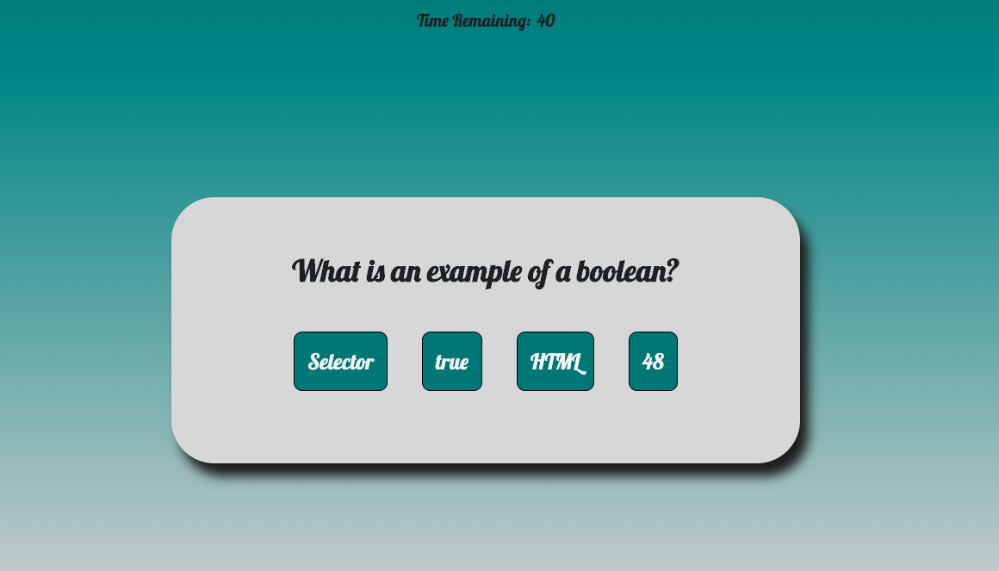
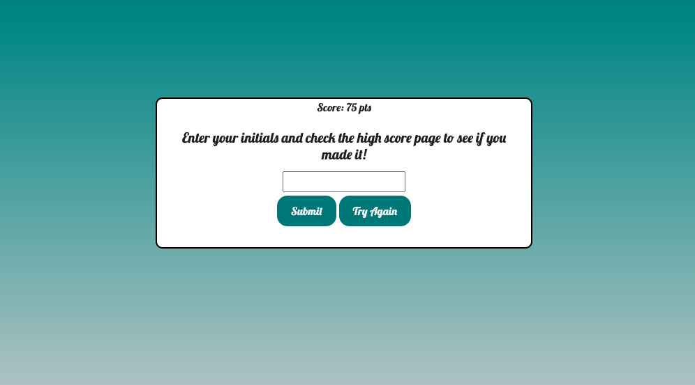
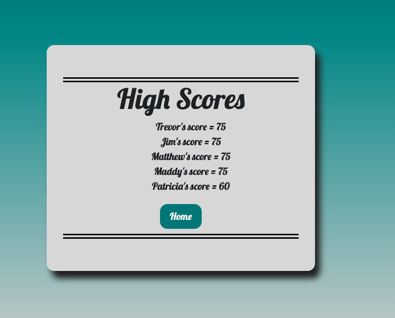

# Code-Quiz

This is homework assignment #4 for the University of Richmond Full Stack Bootcamp.  The main goal of this project was to create a Code Quiz utilizing **HTML5**, **CSS3**, and **Vanilla Javascript**. This application runs in the browser and features DOM manipulation via JavaScript, use of local storage, and more.  When the user is presented with a question, they will either be presented with a positive sound and a flash of green for a correct answer, or a negative sound and flash of red for an incorrect answer.  Also, if the user answers incorrectly, 10 seconds will be deducted from the timer.  The user has 50 seconds to complete the quiz or the quiz will automatically end.  Upon completion of the quiz, the user is able to save their name and score and view their listing on the high scores page.  

## Resources
*Font - https://fonts.google.com/

### License & Copyright

Copyright &copy; Tanner Kirkpatrick 2020